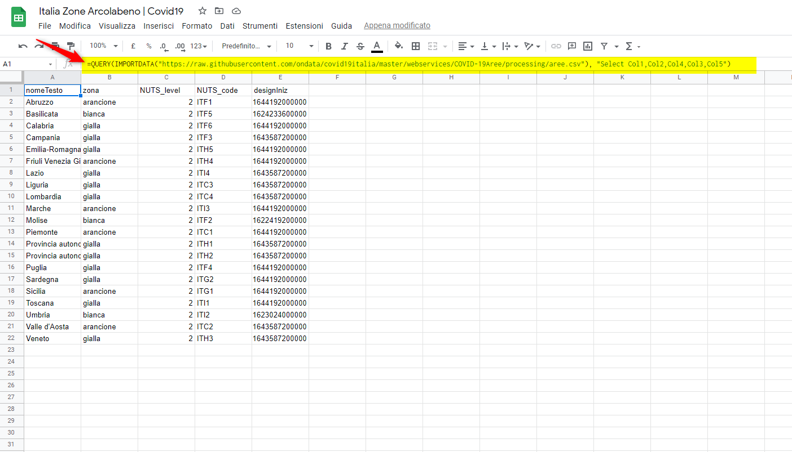
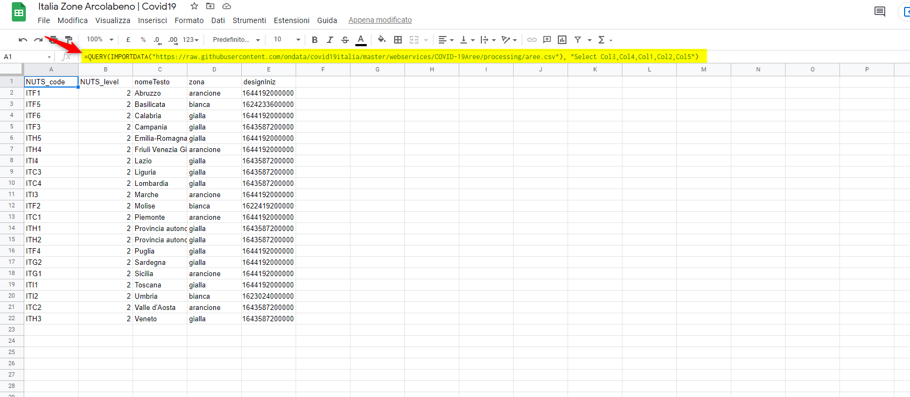
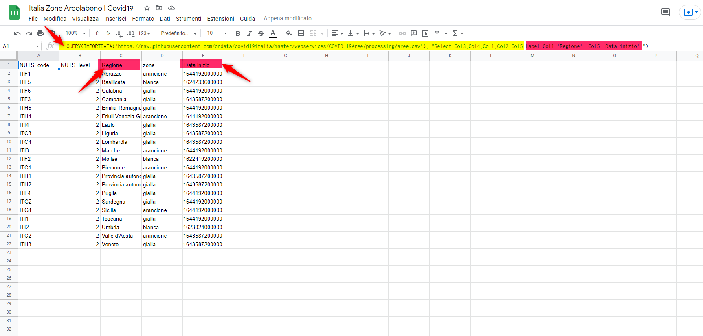

---

Con **IMPORTDATA** google sheet importa i dati di un **url** specificato in formato .csv (valori **separati da virgole**) o .tsv (valori **delimitati da tabulazioni**).

quindi per importare un file  basta posizionarsi in cella qualsiasi e scrivere:

**IMPORTDATA("url")**

url - L'url da cui recuperare i dati in formato .csv o .tsv, incluso il protocollo (ad es. http:// o meglio https://)

**IMPORTDATA("https://raw.githubusercontent.com/ondata/covid19italia/master/webservices/COVID-19Aree/processing/aree.csv")**

Se il file ha un separatore diverso **da virgole** ti consiglio di dare una lettura [qui](https://tansignari.opendatasicilia.it/ricette/csv-tsv/importdata_semicoln_googlesheets/)

Importando il file otteniamo questo:

Ma se a me interessano **SOLO** alcune colonne, ordinate e rinominate in modo diverso, posso farlo? 

Si, si può fare, importando in uno sheet il file csv e in un secondo sheet creare una **QUERY** per selezionre e rinominare le colonne che ci interessano.

Posso importare direttamente **SOLO** i dati che mi interessano?

Si, Per farlo si deve applicare una combinazione di due funzioni: QUERY e IMPORTDATA

`=QUERY(IMPORTDATA("https://raw.githubusercontent.com/ondata/covid19italia/master/webservices/COVID-19Aree/processing/aree.csv"), "Select Col1,Col2,Col4,Col3,Col5")`

Cosi facendo si importano solo le colonne 1, 2, 3, 4, 5, 

Per cambiare l'ordine delle colonne basta semplicemente modificare l'ordine nella selezione **Select** della **QUREY** 

`=QUERY(IMPORTDATA("https://raw.githubusercontent.com/ondata/covid19italia/master/webservices/COVID-19Aree/processing/aree.csv"), "Select Col3,Col4,Col1,Col2,Col5"))`

Se si desidera rinominare le colonne, basta usare **Label** nella nostra **QUERY** per impostare una nuova etichetta.

`=QUERY(IMPORTDATA("https://raw.githubusercontent.com/ondata/covid19italia/master/webservices/COVID-19Aree/processing/aree.csv"), "Select Col3,Col4,Col1,Col2,Col5 Label Col1 'Regione', Col5 'Data inizio' ")`

Fatto...abbiamo importato in un unico sheet i dati che ci interessano...

Ps... perchè la colonna **Data inizio** ha quei numeri strani...? Siamo sicuri che è una data...? 

