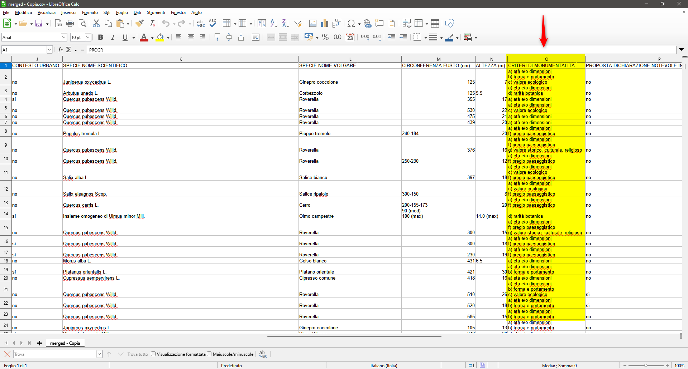
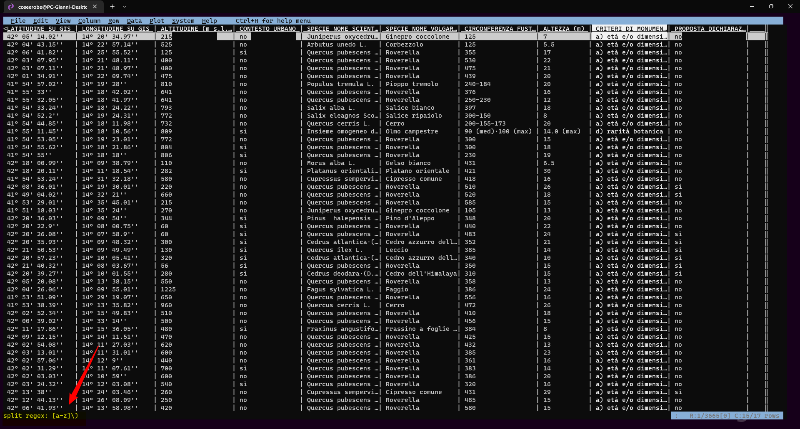
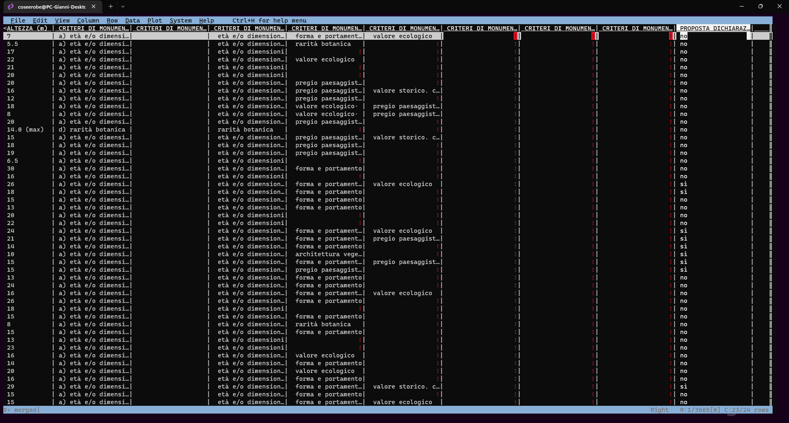
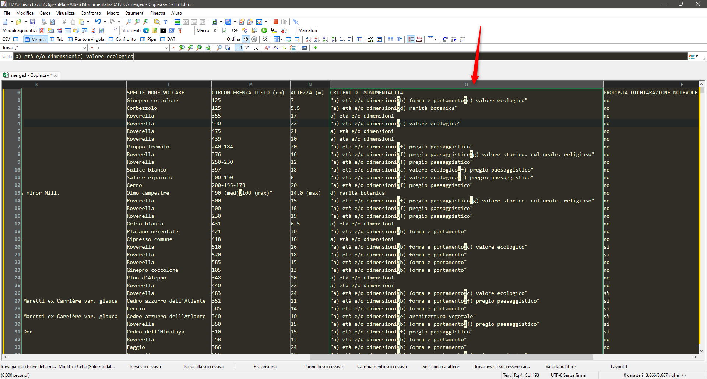
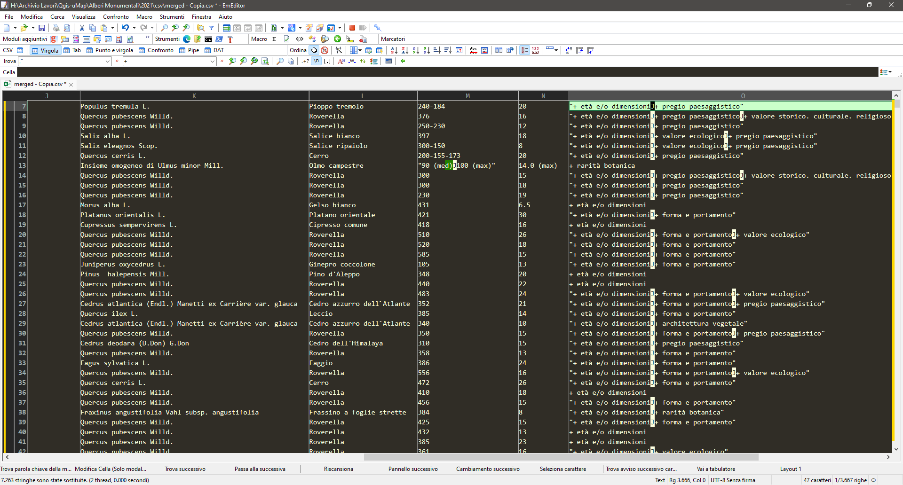
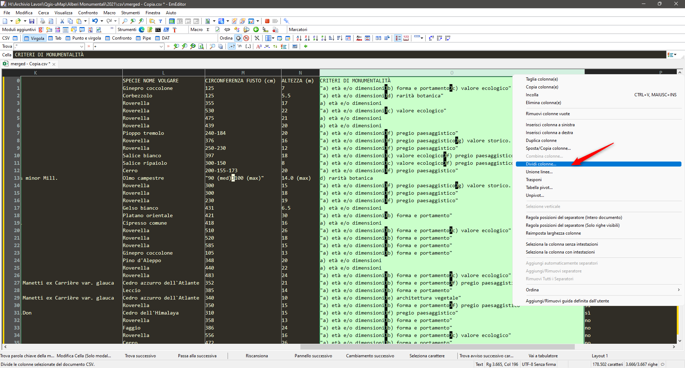

---
Come si può sudividere velocemente in più *colonne* una **colonna** che in ogni cella, il più delle volte ha un elenco puntato?

Esempio:

Obbiettivo: Ottenere **N** *colonne* dalla **colonna X**

| Criterio A            | Criterio B            | Criterio C          | Criterio D         | Criterio E | Criterio F              | Criterio G           |
|-----------------------|-----------------------|---------------------|--------------------|------------|-------------------------|----------------------|
|  età e/o dimensioni   |  forma e portamento   |  valore ecologico   |                    |            |                         |                      |
|  età e/o dimensioni   |                       |                     | rarità botanica    |            |                         |                      |
|  età e/o dimensioni   |                       |                     |                    |            |                         |                      |
|  età e/o dimensioni   |                       |  valore ecologico   |                    |            |                         |                      |
|  età e/o dimensioni   |                       |                     |                    |            |                         |                      |
|  età e/o dimensioni   |                       |                     |                    |            |                         |                      |

Usare il classico **Split** o **Converti il testo in colonne** rende il tutto molto complicato e non sempre il risultato finale e garantito

# Soluzione 1 Visidata

Utilizzando [Visidata](https://www.visidata.org/) e le espressioni regolari, **[esempio di regex](https://regex101.com/r/ZKPWol/1)** si ricavano le nuove colonne in pochi istanti.
Basta aprire il file, spostarsi sulla colonna da **splittare** pigiare i tasti **shift** + **.** im modo da ottenere il comando  `:` ed inserire la stringa *regex*  `[a-z]\)` e pigare **invio**

e come per *magia* in pochi istanti la nostra colonna e il suo contenuto viene suddivisa in **N** 

In questo caso [Visidata](https://www.visidata.org/) ha usato come separatore per le colonne la regola `[a-z]\)` ovvero ha usato i simboli dalla **a** alla **z** che sono seguiti dal simbolo**)**

Domanda: Se non so usare [Visidata](https://www.visidata.org/) e le *regex* c'è un altra soluzione?
Risposta: Impara ad utilizzarli, ti rendono la vita più semplice... 😊 

# Soluzione 2 EmEditor

Per chi è poco pratico di [Visidata](https://www.visidata.org/) e regex può usare [EmEditor](https://www.emeditor.com/) un ottimo strumento per manipolare file csv e non solo.

Apriamo il file con [EmEditor](https://www.emeditor.com/), il contenuto della nostra colnna è un po **sporco** l'elnco puntato non sempre è scritto tutto nello stesso modo,
troviamo:

- a) oppure a )
- b)		b )
- c)		c )
- d)		d )
- e)		e )
- f)		f )
- g)		g )

Come prima cosa dobbiamo sostititure questi elenchi con un simbolo **univoco**

Con una semplice operazione *batch* di **cerca e sosttituisci**  sostituiamo tutti i simboli degli elenchi con il simbolo **+** (o altro simbolo)

Adesso basta selezionare la colonna che si vuole *suddividere* e pigiare il tasto destro del mouse e selezionre **Dividi colonne**

Si aprirà unn popup che permette di selezionare diverse opzioni e il **separatore** da utilizzare

Adesso non resta che pigiare **invio** e anche [EmEditor](https://www.emeditor.com/) aggiungerà le varie colonne 😊

Ps: Anche in [EmEditor](https://www.emeditor.com/) si possono usare le regex, ma non sono riuscito ad usarle per definire il **separatore** 😊

## Riferimenti utili
- [Guida VisiData | Lavorare sulle colonne](https://ondata.github.io/guidaVisiData/lavorareColonne/#nuove-colonne-come-risultato-di-splitting)
- [regex](https://regex101.com/r/ZKPWol/1)
- [EmEditor](https://www.emeditor.com/)